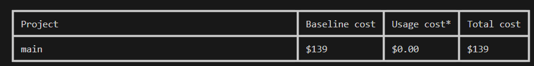

# terraform-aws-eks-airflow

## Introdução
Esse repositorio é responsável por provisionar cluster EKS com o Apache Airflow com o objetivo de facilitar a realização de PoC sobre o Airflow.
O codigo provisiona os seguintes recursos:

- EKS Cluster
- EKS Addons
- EKS NodeGroups
- Deploy Apache Airflow

## Custos:
Custo mensal estimado do projeto (considerando 730 horas/mês):



## Uso:

Para executar este exemplo você precisa executar:

```bash
git clone https://github.com/andersonfariiass/terraform-aws-eks-airflow.git
cd terraform-aws-eks-airflow/
```

Antes de fazer o deploy é preciso realizar um ajuste no arquivo providers.tf onde será configurado qual o profile do aws cli a ser usado para deploy.

```hcl
provider "aws" {
  region  = "us-east-1"
  profile = "my-aws-profile"
}
```

Após o ajuste realizar o deploy.

```bash
terraform init
terraform plan
terraform apply
```

Para destruir o ambiente.

```bash
terraform destroy
```

## Requirements

| Name | Version |
|------|---------|
| <a name="requirement_terraform"></a> [terraform](#requirement\_terraform) | >= 1.1.5 |
| <a name="requirement_aws"></a> [aws](#requirement\_aws) | >= 4.20.1 |
| <a name="requirement_helm"></a> [helm](#requirement\_helm) | >= 2.9 |
| <a name="requirement_kubectl"></a> [kubectl](#requirement\_kubectl) | >= 1.7.0 |
| <a name="requirement_kubernetes"></a> [kubernetes](#requirement\_kubernetes) | >= 2.0.0 |

## Providers

| Name | Version |
|------|---------|
| <a name="provider_aws"></a> [aws](#provider\_aws) | 5.33.0 |
| <a name="provider_helm"></a> [helm](#provider\_helm) | 2.12.1 |
| <a name="provider_kubernetes"></a> [kubernetes](#provider\_kubernetes) | 2.25.2 |

## Modules

| Name | Source | Version |
|------|--------|---------|
| <a name="module_ebs_csi_driver_irsa"></a> [ebs\_csi\_driver\_irsa](#module\_ebs\_csi\_driver\_irsa) | terraform-aws-modules/iam/aws//modules/iam-role-for-service-accounts-eks | ~> 5.20 |
| <a name="module_eks"></a> [eks](#module\_eks) | terraform-aws-modules/eks/aws | 19.21.0 |
| <a name="module_eks_blueprints_addons"></a> [eks\_blueprints\_addons](#module\_eks\_blueprints\_addons) | aws-ia/eks-blueprints-addons/aws | ~> 1.0 |
| <a name="module_s3_bucket"></a> [s3\_bucket](#module\_s3\_bucket) | terraform-aws-modules/s3-bucket/aws | 4.0.1 |

## Resources

| Name | Type |
|------|------|
| [helm_release.airflow](https://registry.terraform.io/providers/hashicorp/helm/latest/docs/resources/release) | resource |
| [kubernetes_ingress_v1.airflow_ingress](https://registry.terraform.io/providers/hashicorp/kubernetes/latest/docs/resources/ingress_v1) | resource |
| [kubernetes_namespace.airflow](https://registry.terraform.io/providers/hashicorp/kubernetes/latest/docs/resources/namespace) | resource |
| [aws_availability_zones.available](https://registry.terraform.io/providers/hashicorp/aws/latest/docs/data-sources/availability_zones) | data source |
| [aws_caller_identity.current](https://registry.terraform.io/providers/hashicorp/aws/latest/docs/data-sources/caller_identity) | data source |
| [aws_eks_cluster_auth.this](https://registry.terraform.io/providers/hashicorp/aws/latest/docs/data-sources/eks_cluster_auth) | data source |
| [aws_lb.load_balancer](https://registry.terraform.io/providers/hashicorp/aws/latest/docs/data-sources/lb) | data source |
| [aws_region.current](https://registry.terraform.io/providers/hashicorp/aws/latest/docs/data-sources/region) | data source |

## Inputs

| Name | Description | Type | Default | Required |
|------|-------------|------|---------|:--------:|
| <a name="input_aws_auth_fargate_profile_pod_execution_role_arns"></a> [aws\_auth\_fargate\_profile\_pod\_execution\_role\_arns](#input\_aws\_auth\_fargate\_profile\_pod\_execution\_role\_arns) | Lista de role ARNs Fargate profile pod execution para adicionar ao mapa de configuração do aws-auth | `list(string)` | `[]` | no |
| <a name="input_aws_auth_roles"></a> [aws\_auth\_roles](#input\_aws\_auth\_roles) | Lista de mapas de roles para adicionar ao configmap do aws-auth | `list(any)` | `[]` | no |
| <a name="input_aws_auth_users"></a> [aws\_auth\_users](#input\_aws\_auth\_users) | Lista de mapas de usuários para adicionar ao configmap do aws-auth | `list(any)` | `[]` | no |
| <a name="input_bucket_name"></a> [bucket\_name](#input\_bucket\_name) | Nome do Bucket para DAGS do Airflow | `string` | n/a | yes |
| <a name="input_cloudwatch_log_group_kms_key_id"></a> [cloudwatch\_log\_group\_kms\_key\_id](#input\_cloudwatch\_log\_group\_kms\_key\_id) | Chave KMS para criptografar os logs groups do cluster. Caso não tenha uma chave passar o valor 'null' | `string` | `null` | no |
| <a name="input_cluster_enabled_log_types"></a> [cluster\_enabled\_log\_types](#input\_cluster\_enabled\_log\_types) | Lista dos logs do control plane desejados para habilitar. Valor default: 'audit', valores aceitos: 'api, audit, authenticator, controllerManager, scheduler' | `list(string)` | <pre>[<br>  "audit"<br>]</pre> | no |
| <a name="input_cluster_endpoint_private_access"></a> [cluster\_endpoint\_private\_access](#input\_cluster\_endpoint\_private\_access) | Indica se o endpoint do servidor de API privado do Amazon EKS está habilitado ou não | `bool` | `true` | no |
| <a name="input_cluster_endpoint_public_access"></a> [cluster\_endpoint\_public\_access](#input\_cluster\_endpoint\_public\_access) | Indica se o endpoint do servidor de API pública do Amazon EKS está habilitado ou não | `bool` | `false` | no |
| <a name="input_cluster_endpoint_public_access_cidrs"></a> [cluster\_endpoint\_public\_access\_cidrs](#input\_cluster\_endpoint\_public\_access\_cidrs) | Lista de blocos CIDR que podem acessar o endpoint do servidor de API pública do Amazon EKS | `list(string)` | <pre>[<br>  "0.0.0.0/0"<br>]</pre> | no |
| <a name="input_cluster_name"></a> [cluster\_name](#input\_cluster\_name) | Nome do cluster EKS | `string` | n/a | yes |
| <a name="input_cluster_tags"></a> [cluster\_tags](#input\_cluster\_tags) | Mapa de tags adicionais para adicionar ao cluster | `map(string)` | `{}` | no |
| <a name="input_cluster_version"></a> [cluster\_version](#input\_cluster\_version) | Versão '<major>.<minor>' do Kubernetes a ser usada para o cluster EKS (Ex: '1.27') | `string` | n/a | yes |
| <a name="input_enable_irsa"></a> [enable\_irsa](#input\_enable\_irsa) | Determina se deve ser criado um OpenID Connect Provider para o cluster EKS ativar o IRSA | `bool` | `true` | no |
| <a name="input_tags"></a> [tags](#input\_tags) | Tags para todos os recursos do módulo | `map(any)` | `null` | no |

## Outputs

| Name | Description |
|------|-------------|
| <a name="output_aws_account_id"></a> [aws\_account\_id](#output\_aws\_account\_id) | Conta onde será feito deploy do terraform |
| <a name="output_cluster_endpoint"></a> [cluster\_endpoint](#output\_cluster\_endpoint) | Endpoint for EKS control plane |
| <a name="output_cluster_name"></a> [cluster\_name](#output\_cluster\_name) | Kubernetes Cluster Name |
| <a name="output_cluster_security_group_id"></a> [cluster\_security\_group\_id](#output\_cluster\_security\_group\_id) | Security group ids attached to the cluster control plane |
| <a name="output_configure_kubectl"></a> [configure\_kubectl](#output\_configure\_kubectl) | Configure kubectl: make sure you're logged in with the correct AWS profile and run the following command to update your kubeconfig |
| <a name="output_load_balancer_hostname"></a> [load\_balancer\_hostname](#output\_load\_balancer\_hostname) | DNS/URL do Load Balancer usado para acessar o airflow |
| <a name="output_oidc_provider_arn"></a> [oidc\_provider\_arn](#output\_oidc\_provider\_arn) | O ARN do provedor OIDC se enable\_irsa = true |

<!-- BEGIN_TF_DOCS -->
## Requirements

| Name | Version |
|------|---------|
| terraform | >= 1.1.5 |
| aws | >= 4.20.1 |
| helm | >= 2.9 |
| kubectl | >= 1.7.0 |
| kubernetes | >= 2.0.0 |

## Modules

| Name | Source | Version |
|------|--------|---------|
| ebs\_csi\_driver\_irsa | terraform-aws-modules/iam/aws//modules/iam-role-for-service-accounts-eks | ~> 5.20 |
| eks | terraform-aws-modules/eks/aws | 19.21.0 |
| eks\_blueprints\_addons | aws-ia/eks-blueprints-addons/aws | ~> 1.0 |
| s3\_bucket | terraform-aws-modules/s3-bucket/aws | 4.0.1 |

## Resources

| Name | Type |
|------|------|
| [helm_release.airflow](https://registry.terraform.io/providers/hashicorp/helm/latest/docs/resources/release) | resource |
| [kubernetes_ingress_v1.airflow_ingress](https://registry.terraform.io/providers/hashicorp/kubernetes/latest/docs/resources/ingress_v1) | resource |
| [kubernetes_namespace.airflow](https://registry.terraform.io/providers/hashicorp/kubernetes/latest/docs/resources/namespace) | resource |
| [aws_availability_zones.available](https://registry.terraform.io/providers/hashicorp/aws/latest/docs/data-sources/availability_zones) | data source |
| [aws_caller_identity.current](https://registry.terraform.io/providers/hashicorp/aws/latest/docs/data-sources/caller_identity) | data source |
| [aws_eks_cluster_auth.this](https://registry.terraform.io/providers/hashicorp/aws/latest/docs/data-sources/eks_cluster_auth) | data source |
| [aws_lb.load_balancer](https://registry.terraform.io/providers/hashicorp/aws/latest/docs/data-sources/lb) | data source |
| [aws_region.current](https://registry.terraform.io/providers/hashicorp/aws/latest/docs/data-sources/region) | data source |

## Inputs

| Name | Description | Type | Default | Required |
|------|-------------|------|---------|:--------:|
| bucket\_name | Nome do Bucket para DAGS do Airflow | `string` | n/a | yes |
| cluster\_name | Nome do cluster EKS | `string` | n/a | yes |
| cluster\_version | Versão '<major>.<minor>' do Kubernetes a ser usada para o cluster EKS (Ex: '1.27') | `string` | n/a | yes |
| aws\_auth\_fargate\_profile\_pod\_execution\_role\_arns | Lista de role ARNs Fargate profile pod execution para adicionar ao mapa de configuração do aws-auth | `list(string)` | `[]` | no |
| aws\_auth\_roles | Lista de mapas de roles para adicionar ao configmap do aws-auth | `list(any)` | `[]` | no |
| aws\_auth\_users | Lista de mapas de usuários para adicionar ao configmap do aws-auth | `list(any)` | `[]` | no |
| cloudwatch\_log\_group\_kms\_key\_id | Chave KMS para criptografar os logs groups do cluster. Caso não tenha uma chave passar o valor 'null' | `string` | `null` | no |
| cluster\_enabled\_log\_types | Lista dos logs do control plane desejados para habilitar. Valor default: 'audit', valores aceitos: 'api, audit, authenticator, controllerManager, scheduler' | `list(string)` | ```[ "audit" ]``` | no |
| cluster\_endpoint\_private\_access | Indica se o endpoint do servidor de API privado do Amazon EKS está habilitado ou não | `bool` | `true` | no |
| cluster\_endpoint\_public\_access | Indica se o endpoint do servidor de API pública do Amazon EKS está habilitado ou não | `bool` | `false` | no |
| cluster\_endpoint\_public\_access\_cidrs | Lista de blocos CIDR que podem acessar o endpoint do servidor de API pública do Amazon EKS | `list(string)` | ```[ "0.0.0.0/0" ]``` | no |
| cluster\_tags | Mapa de tags adicionais para adicionar ao cluster | `map(string)` | `{}` | no |
| enable\_irsa | Determina se deve ser criado um OpenID Connect Provider para o cluster EKS ativar o IRSA | `bool` | `true` | no |
| tags | Tags para todos os recursos do módulo | `map(any)` | `null` | no |

## Outputs

| Name | Description |
|------|-------------|
| aws\_account\_id | Conta onde será feito deploy do terraform |
| cluster\_endpoint | Endpoint for EKS control plane |
| cluster\_name | Kubernetes Cluster Name |
| cluster\_security\_group\_id | Security group ids attached to the cluster control plane |
| configure\_kubectl | Configure kubectl: make sure you're logged in with the correct AWS profile and run the following command to update your kubeconfig |
| load\_balancer\_hostname | DNS/URL do Load Balancer usado para acessar o airflow |
| oidc\_provider\_arn | O ARN do provedor OIDC se enable\_irsa = true |
<!-- END_TF_DOCS -->